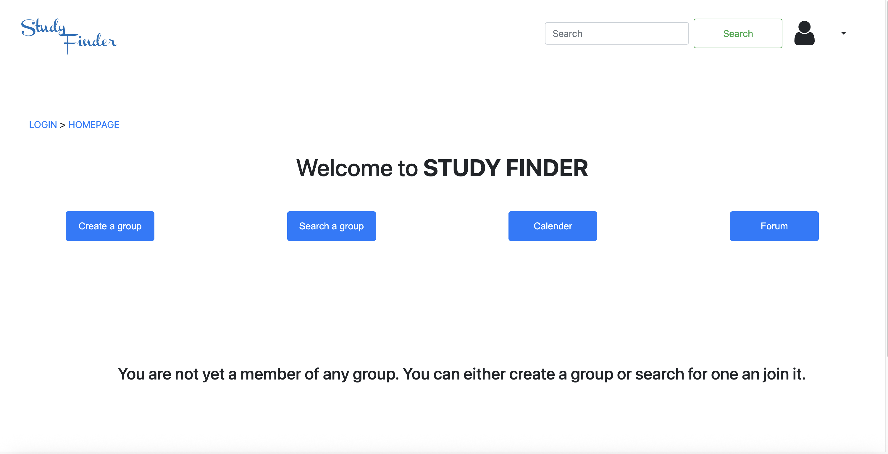

# Study Finder

Study Finder is a web application that helps you find study mates and form learning groups. Whether you want to connect with a study partner or join a group for collaborative learning, Study Finder makes it easy.

## Features

- Find and connect with study mates
- Plan and schedule learning sessions
- Discuss questions via a forum
- Join or create study groups
- Simple, user-friendly homepage

## Getting Started

### 1. Clone the Repository

Clone this repository to your local machine:

```bash
git clone git@github.com:hciays/study-finder.git
```

### 2. Launch the Homepage

Navigate to the project directory:

```bash
cd study-finder
```

Open the homepage.html file in your web browser. You can do this by:

    Double-clicking the file in your file explorer, or

    Using a command in your terminal:
        macOS:
        open homepage.html
        Linux:
        xdg-open homepage.html
        Windows:
        start homepage.html

No installation or setup is required—just open the HTML file and start exploring!
